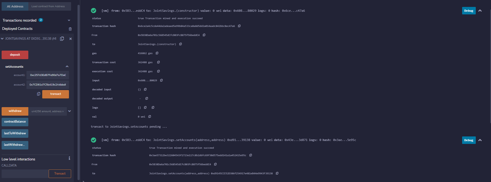
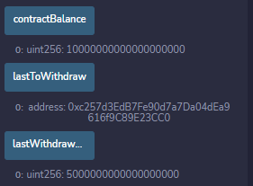

# Joint_Savinngs_Account  
This application creats smart conntract on the Ethereum network, using Solidity, the contract will host joint saving accounts. The user will input the addresses and allow them to transfer Ethereum between accounts.

## Results  
Account set up

  

Deposit to Account  

  
  
Eth transaction to account 1  
  

Contract balance

